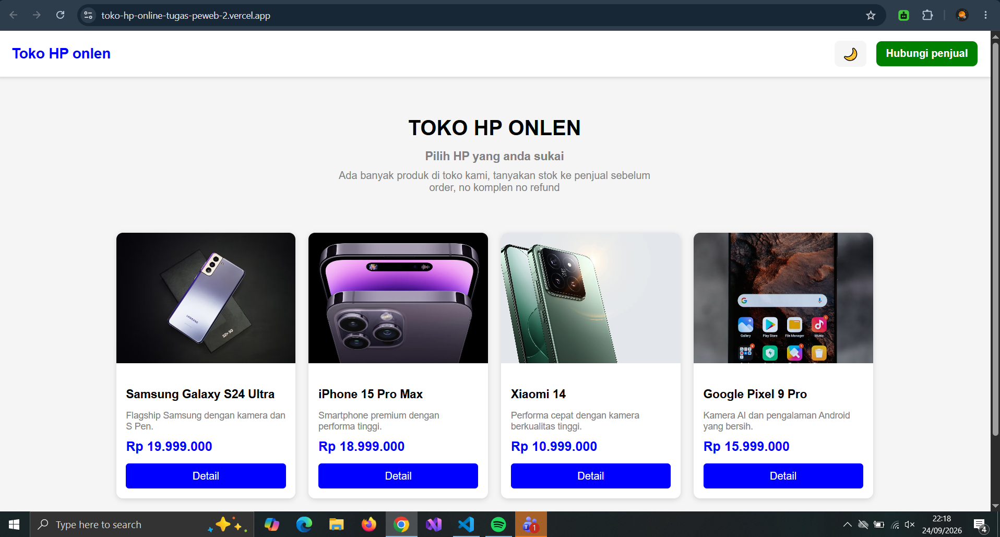
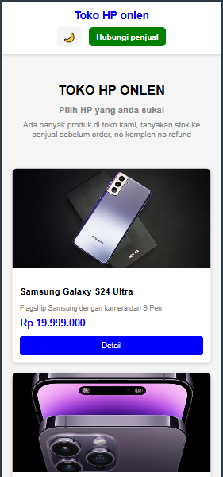
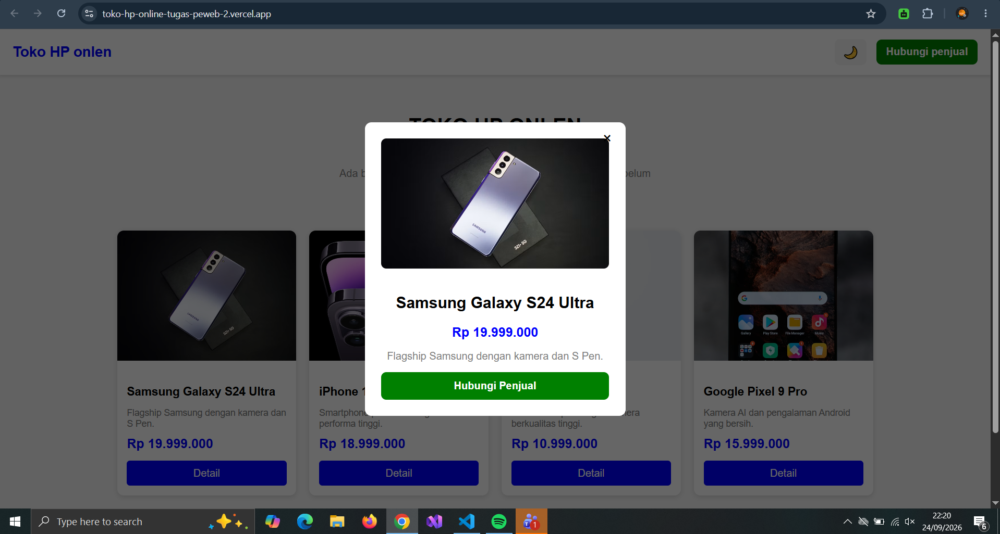
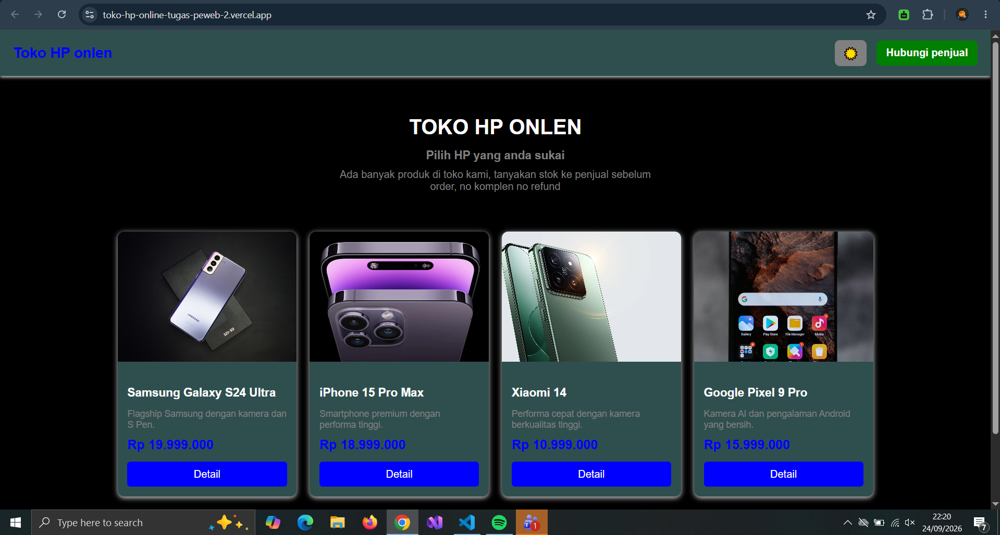

## Struktur Folder
Toko-HP-Onlen/
1. index.html
2. style.css
3. script.js
4. README.md

## index.html Berisi struktur utama website seperti:

1. Navbar
2. Informasi toko
3. Card produk
4. Modal detail produk
5. Footer

## style.css Berisi seluruh tampilan website seperti:

1. Layout
2. Warna
3. Ukuran
4. Responsive design
5. Hover effect
6. Dark Mode
7. Tampilan popup/modal

## script.js Digunakan untuk memberikan interaksi pada website, seperti:

1. Membuka popup detail produk
2. Menutup popup
3. Mengubah isi popup berdasarkan produk
4. Mengubah class CSS
5. Mengaktifkan Dark Mode
6. Membuat link WhatsApp berdasarkan produk

## Implementasi materi manipulasi dom

1. dark mode

- Website memiliki fitur Dark Mode yang dapat diaktifkan melalui tombol 🌙.

- JavaScript mengubah class pada elemen body:

- document.body.classList.toggle("dark");

- Kemudian CSS memberikan tampilan berbeda ketika class dark aktif:

body.dark {
    background-color: #0f172a;
    color: #e5e7eb;
}

2. Popup Detail Produk

- Ketika pengguna menekan tombol Detail, JavaScript akan:

- Mencari card produk yang dipilih.
- Mengambil gambar produk.
- Mengambil nama produk.
- Mengambil harga.
- Mengambil deskripsi.
- Memasukkan data tersebut ke dalam popup.
- Menampilkan popup dengan menambahkan class CSS.

## Screenshot

### Tampilan Desktop

### Tampilan Mobile

### Popup Detail Produk

###  Dark Mode

